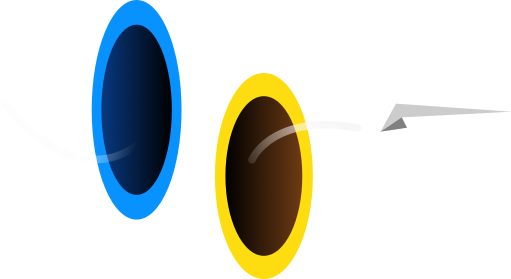
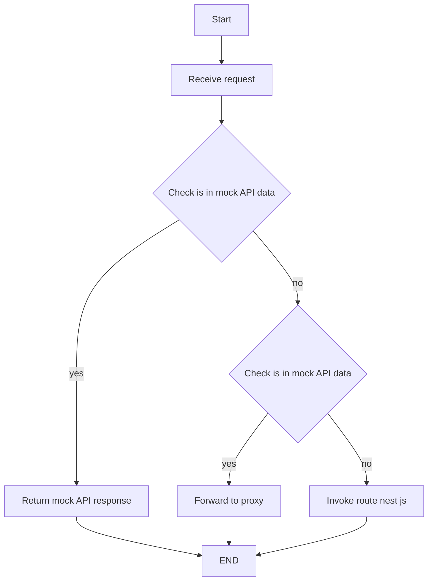
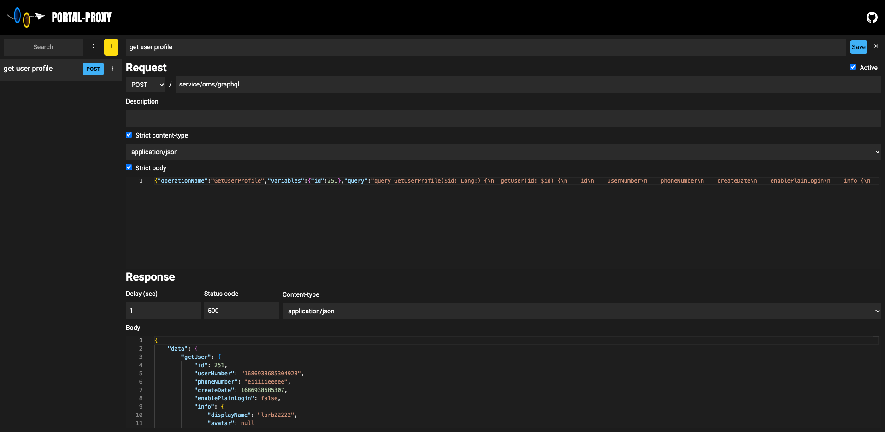
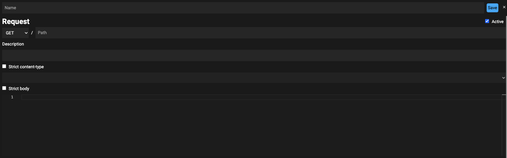
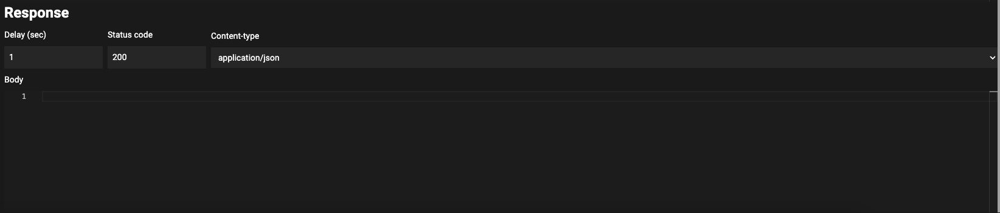
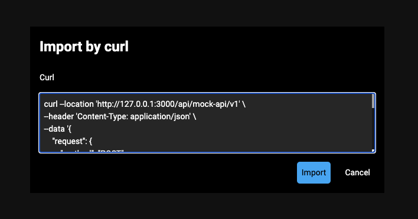

# Portal-proxy

## Portal-proxy : interceptor reverse proxy tool

Portal proxy คือ Proxy gateway ที่สามารถ Mock API Response ได้ไม่ว่าจะเป็น Status code, Delay, Body และ Content type เพื่อทำการจำลอง Situation ในการเรียก API ในฝั่ง Front-end ในหลายๆ Situation เช่น Success และ Fail เป็นต้น ในขณะเดียวกัน Portal proxy สามารถทำเป็น Reverse proxy ได้ด้วย ทำให้สามารถใช้ Reverse proxy ควบคู่ไปกับการ Mock API Response บาง API ได้

## Tech stack

### Front-end
- Tailwind css
- Angular

### Back-end
- Node.js
- Nest JS

## Core concept

Concept หลักในการทำงานของ Portal proxy หลังจากได้รับ Request จะทำงานตาม Flow chart ดังนี้ไปนี้

## Config file

การตั้งค่าโปรแกรม Portal proxy จะประกอบไปด้วย 2 ไฟล์ตั้งนี้

### proxy.json

เป็น File ที่เก็บข้อมูลการตั้งค่า Reverse proxy โดยอิงตาม Standard ของ Package ดังต่อไปนี้ [https://www.npmjs.com/package/http-proxy-middleware](https://www.npmjs.com/package/http-proxy-middleware)

> โดยสามารถดูตัวอย่างการตั้งค่าได้ใน path example-config/proxy.json

### mock-api.json

เป็น File ที่เก็บข้อมูลการตั้งค่า Mock API โดยในไฟล์นี้แนะนำในแก้ไขผ่าน UI

# UI

Portal proxy มี Part ของ UI เพื่อให้ทำการ Setting ค่า Mock API ได้ใน Runtime โดยวิธีเข้าใช้งานให้ไปที่ URL ดังต่อไปนี้ 

> {{basePath}}/ui
> 

จากภาพจะเห็นได้ว่ามี Form ที่ประกอบด้วยกัน 2 ส่วนได้แก่

## Request

เป็นส่วนที่ใช้ Set เงื่อนไขการ Mock API

โดยจะมี Field ต่างๆ ดังต่อไปนี้

| Field | Meaning |
| --- | --- |
| Name | ชื่อ Mock api ถ้าไม่ใส่ข้อมูลระบบจะนำชื่อ Path มาตั้งชื่อ |
| Method | HTTP Method ที่ใช้ในการเรียก API |
| Path | Path ที่ใช้ในการเรียก API |
| Active | การเปิดการใช้งาน Mock api สำหรับ เส้น API นี้ |
| Description | คำอธิบายเพิ่มเติม |
| Strict content-type | กำหนด เงื่อนไขให้ Request ที่เข้ามาต้องมี Content-type ดังต่อไปนี้ ถึงจะเข้าเงื่อนไขการเรียกใช้งาน Mock API |
| Strict body | กำหนด เงื่อนไขให้ Request ที่เข้ามาต้องมี Body ดังต่อไปนี้ ถึงจะเข้าเงื่อนไขการเรียกใช้งาน Mock API |

## Reponse

เป็นส่วนที่ใช้ Set Response ของ Mock API

| Field | Meaning |
| --- | --- |
| Delay (sec) | เวลาหน่วย วินาที ก่อนที่ Reponse จะ Return |
| Status code | HTTP status code ที่ต้องการ Return |
| Content-type | Content-type ที่ต้องการ Return |
| body | Body ที่ต้องการ Return |

## Import by curl

เป็น Feature ที่ช่วยในการสร้างข้อมูลการ Mock API ด้วย cURL โดยจะช่วยให้การสร้างการ Mock API สะดวกมากยิ่งขึ้น

