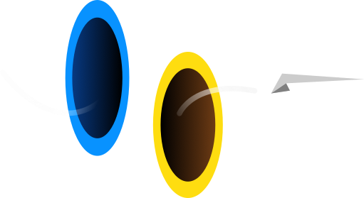
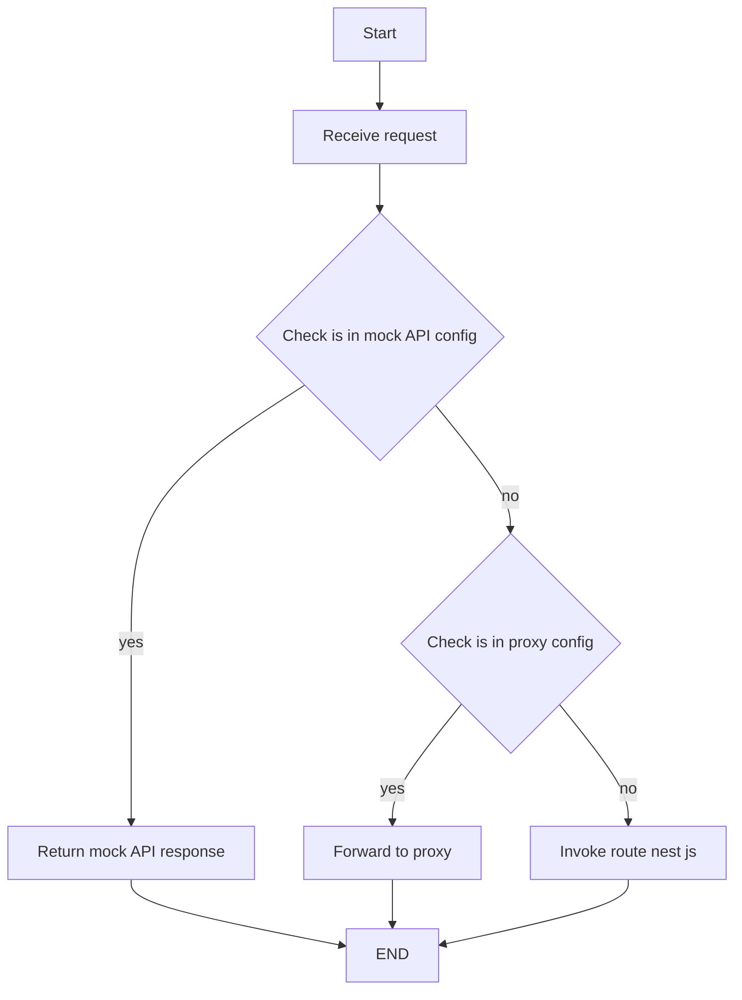
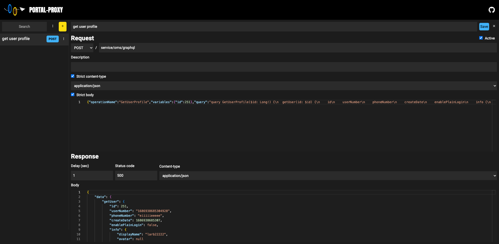
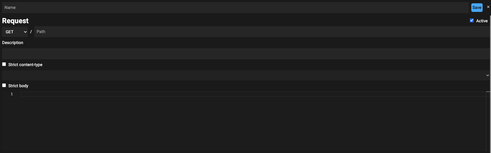
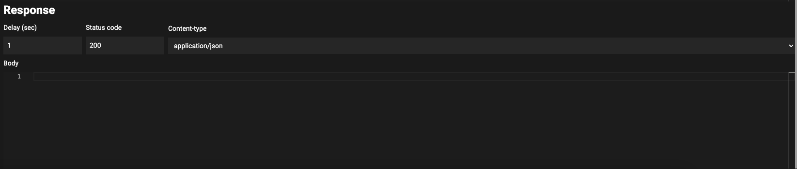
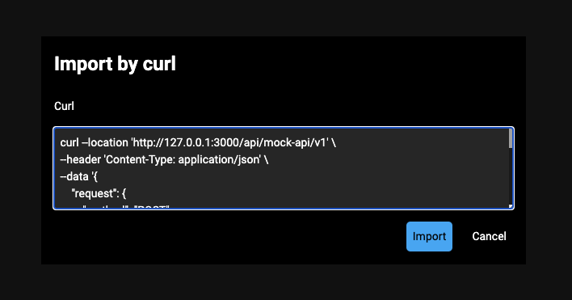

# Portal-proxy

  

## Portal-proxy : Proxy gateway tool

Portal-proxy is a proxy gateway that allows you to mock API responses, including status codes, delays, response bodies, and content types. This enables front-end developers to simulate various API scenarios, such as successful responses and failures, without depending on a real backend.

Additionally, Portal-proxy can function as a reverse proxy, allowing you to mock some API responses while forwarding other requests to actual backend services.

> The name "Portal" was inspired by the game Portal, symbolizing the idea of seamlessly transporting requests between different endpoints.

## Tech stack

### Front-end
- Tailwind css
- Angular

### Back-end
- Node.js
- Nest JS

## Core concept

The main concept of Portal-proxy is based on the following request-handling flow:

```mermaid
flowchart TD
  Start --> revceiveReq[Receive request]
	revceiveReq --> checkInMockAPI{Check is in mock API config}
	checkInMockAPI -- yes --> returnMock[Return mock API response]
	returnMock --> END
	checkInMockAPI -- no --> checkInProxy{Check is in proxy config}
	checkInProxy -- yes --> forwardToProxy[Forward to proxy]
	forwardToProxy --> END
	checkInProxy -- no --> invokeRouteInNestJs[Invoke route nest js]
	invokeRouteInNestJs --> END
	
```

## Config file

Portal-proxy requires two main configuration files:

### proxy.json

This file stores reverse proxy settings and follows the standard format of the [http-proxy-middleware](https://www.npmjs.com/package/http-proxy-middleware)

> Example configurations can be found in example-config/proxy.json.

### mock-api.json

This file contains mock API configurations, which can be modified through the Portal-proxy UI for easier management.

# UI

Portal-proxy provides a UI for real-time mock API configuration. You can access it at:

> {{basePath}}/ui

The UI consists of two main sections:

## Request

This section allows you to define the conditions for mocking an API request.

| Field | Meaning |
| --- | --- |
| Name | Name of the mock API. If left empty, the system will use the Path as the name. |
| Method | HTTP method (GET, POST, etc.) for the request. |
| Path | The request path to be mocked. |
| Active | Toggle to enable or disable the mock API for this route. |
| Description | Additional details about the mock API. |
| Strict content-type | Specifies that incoming requests must have the defined Content-Type to match this mock API. |
| Strict body | Defines specific request body conditions that must be met for the mock API to be triggered. |

## Reponse

This section allows you to define the mock API's response.

| Field | Meaning |
| --- | --- |
| Delay (sec) | Time in seconds before the response is returned. |
| Status code | HTTP status code for the response. |
| Content-type | Content-Type of the response. |
| body | The response body content. |

## Import by curl

This feature allows you to quickly generate mock API configurations by pasting a cURL request, making it easier to set up new mock APIs.

